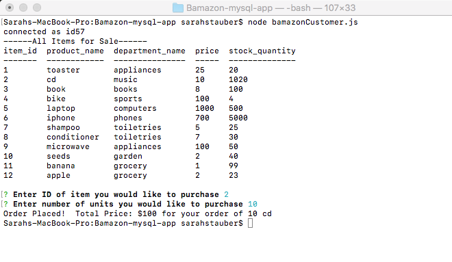
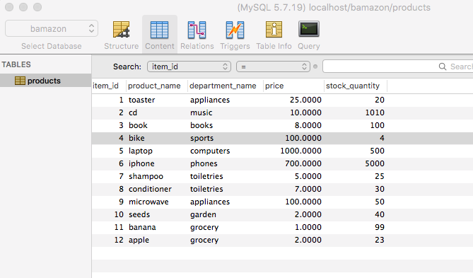
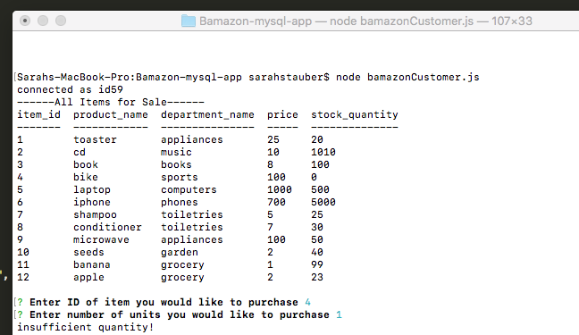
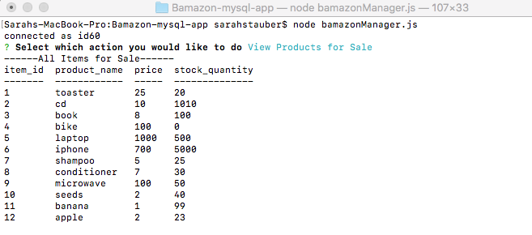
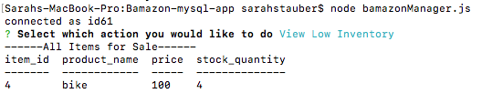
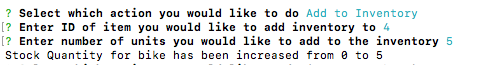
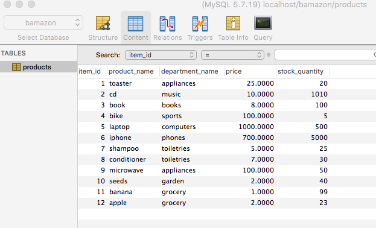
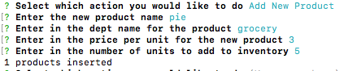
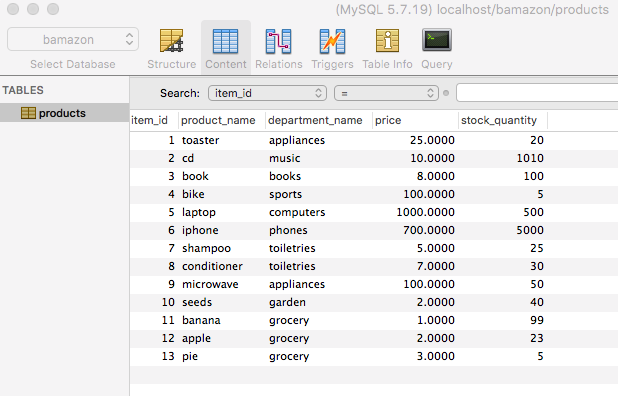

# Bamazon-mysql-app

#  Purpose
This project demonstrates inventory and purchasing abilities using the console and mySQL.

1. Customer ordering Success

2. Customer ordering fail

3. Manager View all Products

4. Manager View Low inventory

5. Manager Adds to Inventory

6. Manager Adds new Product

# Help
Users can get help with this project be reaching out to the owner of the github repo

# Contributors
the owner of the github repo miantains and contributes to this project